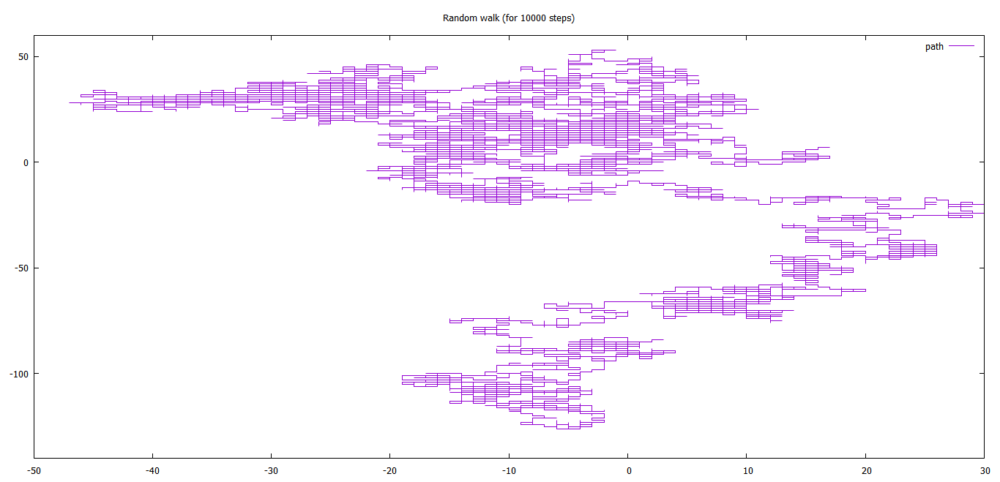
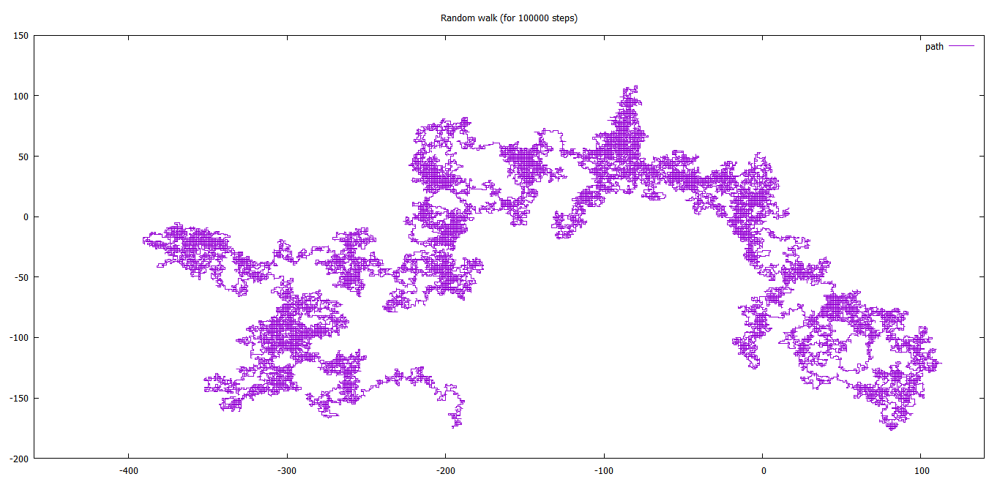
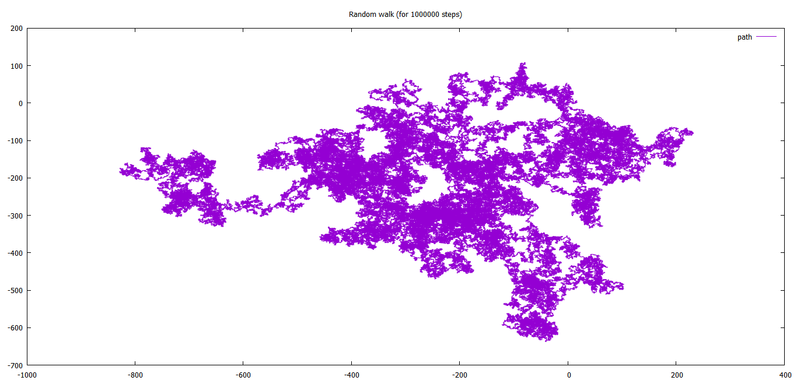

### Random Walk 2D:
In this example, the directions that a random walker can take are limited to four namely, forward, backward, left and right. Starting point is (0,0)

- For 10,000 steps:

- For 100,000 steps:

- For 1,000,000 steps:

***

#### Extra:
Python implementation of Random Walk under above mentioned conditions (using Turtle module): [*link*](RdWalk2D.py) 
